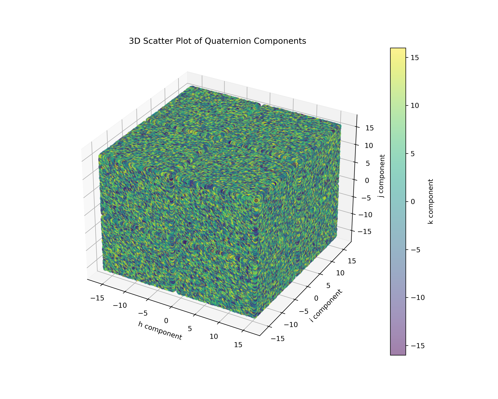
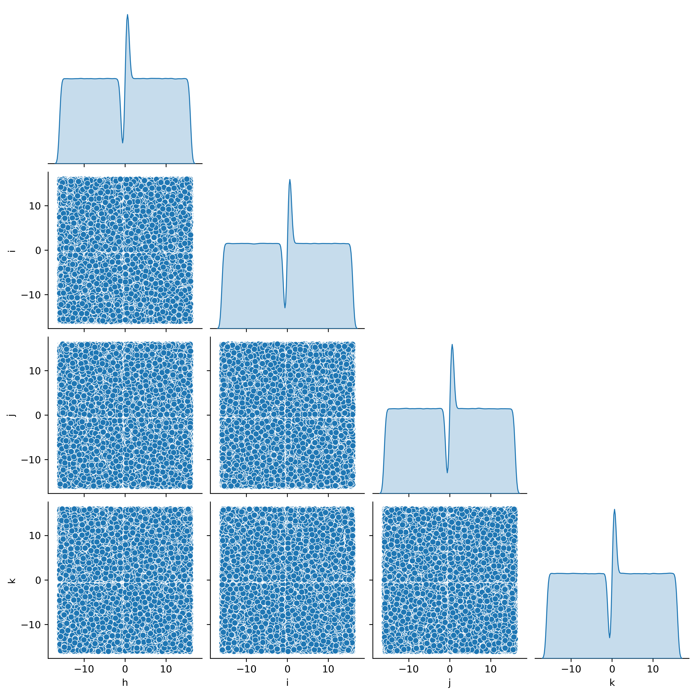
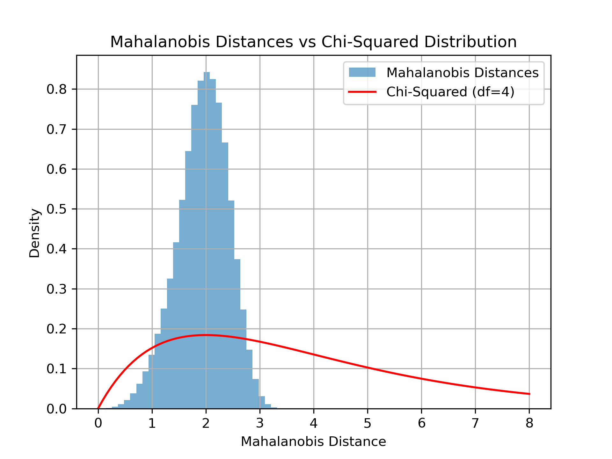

# Quaternion Generator and Analysis

This project generates indeterministic quaternion complex numbers in the form:

\[
Q = ah + bi + cj + dk
\]

where \( h, i, j, k \) are quaternion basis vectors, and the components \( a, b, c, d \) are drawn from independent Gaussian distributions. The generator is implemented as a Linux `/dev/quaternion` device driver, and a suite of Python scripts provides statistical analysis and visualizations.

---

## Features

### 1. Quaternion Generator (/dev interface)
- Generates quaternions with independent Gaussian-distributed components.
- Components range between \(-16\) and \(+16\), scaled from fixed-point arithmetic.
- Output is streamed via `/dev/quaternion`.

### 2. Statistical Analysis
Python scripts analyze the generated quaternions:
- **Multivariate Gaussian test**: Verifies the data's Gaussian distribution.
- **Mahalanobis distance analysis**: Compares Mahalanobis distances to the theoretical chi-squared distribution.
- **Variance and correlation analysis**: Measures variances and correlations between components.

### 3. Visualizations
- **3D Scatter Plot**: Visualizes quaternion components in a 3D space.
- **Pairwise Scatter Plot**: Pairwise relationships and distributions of components.
- **Mahalanobis Histogram**: Compares Mahalanobis distances with the chi-squared distribution.

---

## Installation

### Prerequisites
1. **Linux Kernel Development Tools**
   ```bash
   sudo apt install build-essential linux-headers-$(uname -r)
   ```
2. **Python Environment**
   - Install Python 3.8+
   - Create a virtual environment:
     ```bash
     python3 -m venv myenv
     source myenv/bin/activate
     ```
   - Install required Python libraries:
     ```bash
     pip install numpy matplotlib seaborn
     ```

### Building the Kernel Module
1. Clone the repository:
   ```bash
   git clone https://github.com/Qubitdyne/dev_quaternion.git
   cd quaternion-generator
   ```
2. Build and load the kernel module:
   ```bash
   make
   sudo insmod quaternion.ko
   ```
3. Verify the device:
   ```bash
   ls /dev/quaternion
   ```

---

## Usage

### 1. Generate Quaternion Data
Output quaternions to a file:
```bash
sudo cat /dev/quaternion | head -n 10000000 > quaternions.txt
```

### 2. Analyze Data
Run the provided Python scripts for analysis and visualization:

#### Multivariate Gaussian Test
```bash
python3 multivariate_gtest.py
```
Example output:
```
Mean: [0.03224541 0.02656311 0.02722455 0.02464791]
Covariance Matrix:
 [[ 8.53811937e+01 -1.12989828e-02 -7.35170146e-03  3.54985011e-02]
 [-1.12989828e-02  8.53231369e+01 -1.99751844e-02  5.74578123e-03]
 [-7.35170146e-03 -1.99751844e-02  8.53506152e+01 -3.93849926e-02]
 [ 3.54985011e-02  5.74578123e-03 -3.93849926e-02  8.53545864e+01]]
```

#### Mahalanobis Analysis
```bash
python3 mahalanobis_analysis.py
```
Example output:
```
Mean Mahalanobis Distance: 1.943155791389275
Standard Deviation of Mahalanobis Distances: 0.47343972202782014
KS Statistic: 0.5698722823418253
P-Value: 0.0
```

#### Variance Analysis
```bash
python3 variance_analysis.py
```
Example output:
```
Variances of Components (h, i, j, k): [85.38118516 85.3231284  85.35060664 85.35457789]
Correlation Matrix:
 [[ 1.00000000e+00 -1.32380747e-04 -8.61198815e-05  4.15829670e-04]
 [-1.32380747e-04  1.00000000e+00 -2.34074477e-04  6.73290131e-05]
 [-8.61198815e-05 -2.34074477e-04  1.00000000e+00 -4.61438694e-04]
 [ 4.15829670e-04  6.73290131e-05 -4.61438694e-04  1.00000000e+00]]
```

---

## Visualizations

### 3D Scatter Plot


### Pairwise Scatter Plot


### Mahalanobis Histogram


---

## License
This project is licensed under the MIT License. See `LICENSE` for details.

---

## Contributing
Contributions are welcome! Please fork the repository and submit a pull request.

---

## Acknowledgments
This project was inspired by exploring the relationship between randomness, Gaussian distributions, and quaternion mathematics in computational systems.
